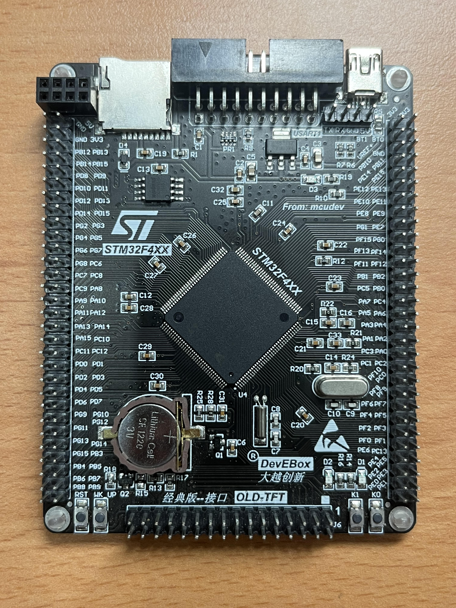

# STM32F4 HAL Examples

This repo contains some example code of STM32F4 for beginners, it uses Hardware Abstraction Layer(HAL) library and FreeRTOS to show how to build some basic programs

## Build Projects
Generally, ST has a software called STM32CubeMX to help programmers to build a basic project, but here provides two basic templates and a shell script to build a project without STM32CubeMX.

```shell
# Build a project only with HAL
./build.sh <path/><new project name>

# Build a project with HAL and FreeRTOS
./build.sh --rtos <path/><new project name>

# If there has any error, the shell script will print error message.
```

* building example
```
# Build a project 'test' in the current directory
./build.sh test

# Build a project 'test' in the 'peripheral' directory
./build.sh peripheral/test

# Build a project 'test' with FreeRTOS source in the current directory
./build.sh --rtos test

# Build a project 'test' with FreeRTOS source in the 'freertos' directory
./build.sh --rtos freertos/test
```

## Development platform and hardware
* GNU/Linux and GCC toolchain
* The code have been tested on STM32F4xx



## Development environment setup

Here provides a simple tutorial to setup the environment.

### 0. Prerequisite
```
sudo apt install build-essential git zlib1g-dev libsdl1.2-dev automake* autoconf* libtool libpixman-1-dev lib32gcc1 lib32ncurses5 libc6:i386 libncurses5:i386 libstdc++6:i386 libusb-1.0.0-dev
```

### 1. OpenOCD
A free and open on-chip debugging, in-system programming and boundary-scan testing tool for ARM and MIPS systems

```
git clone git://git.code.sf.net/p/openocd/code openocd
cd openocd
./bootstrap
./configure --prefix=/usr/local  --enable-jlink --enable-amtjtagaccel --enable-buspirate  --enable-stlink   --disable-libftdi
echo -e "all:\ninstall:" > doc/Makefile
make -j4
sudo make install
```

### 2. ST-LINK
A series of tools to flash programs to STM32 device
```st-flash```, ```st-info```, ```st-trace```, ```st-util```

```
git clone http://github.com/texane/stlink.git
cd stlink
mkdir build
cd build
cmake ..
make -j4
sudo make install
#sudo cp 49-stlinkv2.rules /etc/udev/rules.d/
```

### 3. ARM GCC toolchain 9
```
wget https://developer.arm.com/-/media/Files/downloads/gnu-rm/9-2019q4/gcc-arm-none-eabi-9-2019-q4-major-x86_64-linux.tar.bz2
tar jxf ./gcc-arm-none-eabi-9-2019-q4-major-x86_64-linux.tar.bz2
rm gcc-arm-none-eabi-9-2019-q4-major-x86_64-linux.tar.bz2
```

edit "~/.bashrc" and append the following instruction:

```
PATH=$PATH:~/workspace/tools/gcc-arm-none-eabi-9-2019-q4-major/bin
```

### 4. Restart the terminal

## Examples
Here provides a learning order for STM32 beginners.

### Peripheral manipulation
1. GPIO 
	* ```gpio/```: Use two GPIO pins as output, and let two LEDs blink
2. UART
	1. ```uart/```: Use USB-to-TTL module (ch340 or cp2102) to do data transmission.
	2. ```uart-it/```: Like 2.1, but it uses interrupt to transmit data instead of polling.
	3. ```uart-dma/```: Like 2.1, but it transmits data once by DMA.
3. System Clock
	* ```sysclk/```: Set system core clock to 168 MHz by HSE oscillator.
4. Systick
	* ```systick/```: Set system tick timer(systick) to let a LED blink.
5. timer
	* ```timer/```: Set a timer to let a LED blink
6. PWM
	* ```pwm/```: Let two LEDs be adjusted thier brightness.
7. ADC
	* ```adc-it/```: Use analog to digital converter (ADC) to detect the strength of a input signal.

### FreeRTOS
1. Create some tasks
	* ```create_task/```: Use FreeRTOS scheduler to schedule two tasks.
2. Inter-Process Communication (IPC)
	* ```queue/```: Let two tasks communicate with each other by queue.
3. Semaphore
	* ```semaphore/```: Let every task get the lock of a shared source and do their work.

### Needed Tool
[ST-LINK/V2 in-circuit debugger/programmer for STM8 and STM32](https://www.mouser.tw/ProductDetail/Adafruit/2548?qs=SElPoaY2y5K%252BwHNUAvyTvg%3D%3D)
* STM32 Board SWDIO <---> ST-LINK/V2 SWDIO
* STM32 Board SWCLK <---> ST-LINK/V2 SWCLK
* STM32 Board GND <---> ST-LINK/V2 GNU

## Reference
* [stm32f4-examples](https://github.com/shengwen-tw/stm32f4-examples) : A series of STM32F4 examples written in Standard Peripheral Library (SPL)
	* This repo is inspired by it, and uses HAL to build the basic programs.
* [NCKU Wikipedia](http://wiki.csie.ncku.edu.tw/embedded/Lab25)
* [STM32F4 SPEC](spec/) : The necessary specifications of STM32F4 series.
