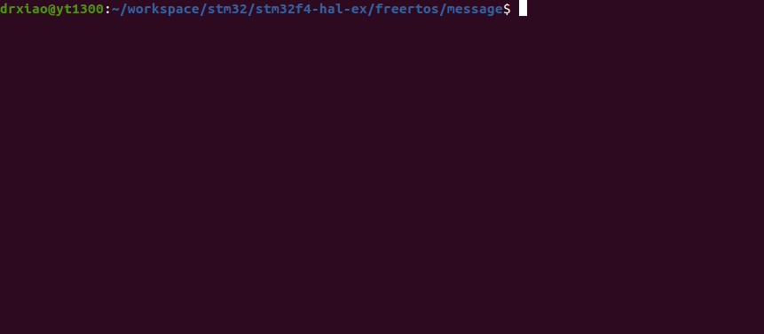

# STM32F4XX with FreeRTOS - Message Buffer
```shell
make
make flash
screen /dev/ttyUSB0
```

## Demo
* Remember to connect USART1 before using screen.
* Inter-Process Communication is implemented by message buffer in FreeRTOS.
* Notice that message buffer is suitable for single producer single consumer scenarios.
* If the buffer is too small to receive the message, the message will be left.


