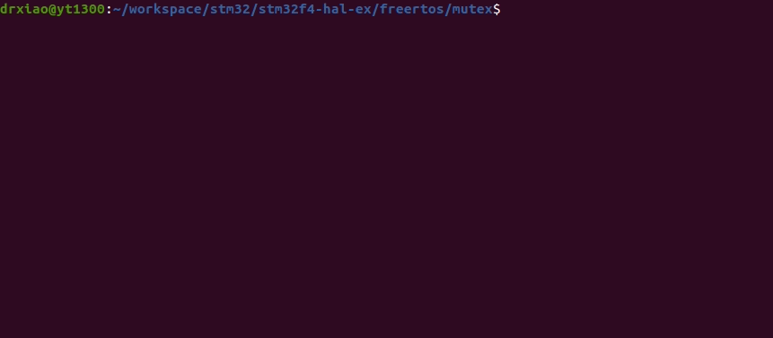
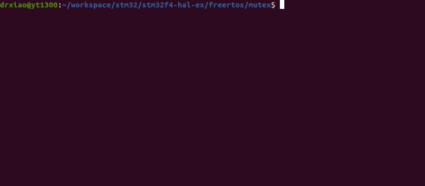

# STM32F4XX with FreeRTOS - Mutex
```shell
make
make flash
screen /dev/ttyUSB0
```

## Demo
* Remember to connect USART1 before using screen.
### With mutex
* the 5 tasks will print their string in order.



### Without mutex
* the behavior may work unnormally as following.
* The demo has been uncommented ```xSemaohoreTake``` and ```xSemaphoreGive``` in ```task``` function.


