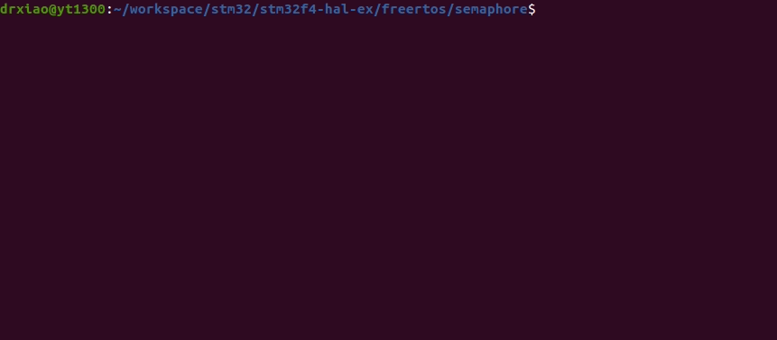
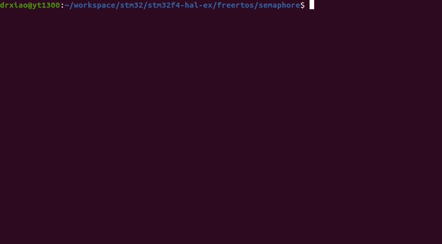

# STM32F4XX with FreeRTOS - Semaphore
```shell
make
make flash
screen /dev/ttyUSB0
```

## Demo
### With Semaphore
* the 10 tasks will print their string in order.



### Without Semaphore
* the behavior may work unnormally as following.

