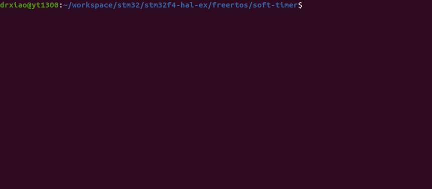

# STM32F4XX with FreeRTOS - Software Timer
```shell
make
make flash
screen /dev/ttyUSB0
```

## Demo
* Remember to connect USART1 before using screen.
* By software timer, it will print the string ```"Hello Timer!"``` per second.
* Be aware of the following modification in source code ...
	* In ```FreeRTOSConfig.h```, ```configUSE_TIMERS``` and relative macro are defined.
		* When defing ```configUSE_TIMERS``` as 1, the relative functions in FreeRTOS will be compiled.
	* In ```freertos.c```, the static variables and functions related to software timer are also defined.


