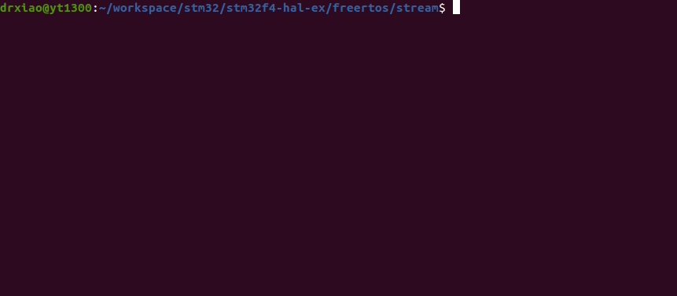

# STM32F4XX with FreeRTOS - Stream Buffer
```shell
make
make flash
screen /dev/ttyUSB0
```

## Demo
* Remember to connect USART1 before using screen.
* Inter-Process Communication is implemented by stream buffer in FreeRTOS.
* Notice that stream buffer is suitable for one producer and one consumer scenario.


