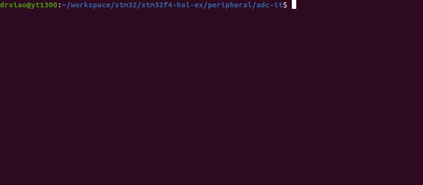

# STM32F4XX - Analog to Digit (ADC)
```shell
make
make flash
screen /dev/ttyUSB0
```

## Demo
* Remember to connect USART1 before using screen.
* Let PA3 be connected to 3V3 after using screen, then it will prints values closed to 4096 approxmiately.


