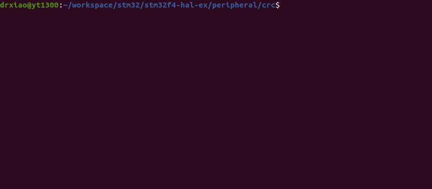

# STM32F4XX - Cyclic Redundancy Check (CRC)
```shell
make
make flash
screen /dev/ttyUSB0
```

## Demo
* Remember to connect USART1 before using screen.
* Reset the STM32 board to obtain the CRC value after using screen.



