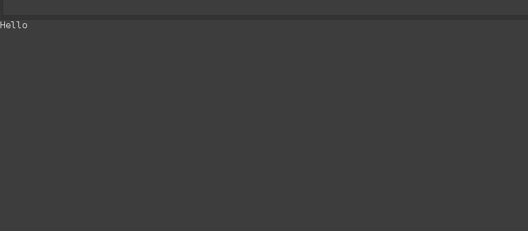

# STM32F4XX - Inter-Integrated Circuit (I2C / IIC)
* STM32
```shell
make
make flash
```

* Arduino UNO
```
-> upload arduino_i2c_slave.ino code to Arduino UNO by Arduino IDE.
```


## Demo
* Connecting STM32 and Arduino UNO
	* SDA : STM32 5V <---> 4.7K ohm resistor <---> STM32 PA7 <---> UNO A4
	* SCL : STM32 5V <---> 4.7K ohm resistor <---> STM32 PA6 <---> UNO A5
	* GND : STM32 GND <---> UNO GND

* Diagram
```
STM32 5V --------------------------------	
		|			|
		\			\
		/			/
		4.7K ohm		4.7K ohm
		\			\
		/			/
		|			|
		|			---------------------------------
		|				|			|
		|				|			|
		|				STM32 PA6		UNO A5
		|
		| 
		---------------------------------
			|			|
			|			|
			STM32 PA7		UNO A4


			STM32 GND		UNO GND
			|			|
GND----------------------------------------------
```
	
* Open serial monitor by Arduino IDE. (Or, use ```screen``` to monitor ```/dev/ttyACM0```.)
* Then, Arduino will receive the data sent from STM32 continuously.



