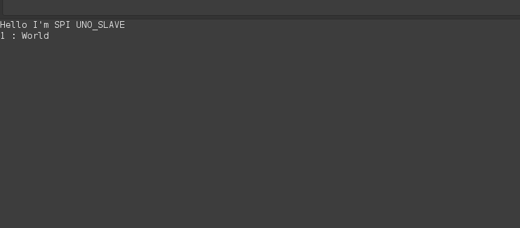

# STM32F4XX - Standard Peripheral Interface (SPI)
* STM32
```shell
make
make flash
```

* Arduino UNO
```
-> upload arduino_spi_slave.ino code to Arduino UNO by Arduino IDE.
```


## Demo
* Connecting STM32 and Arduino UNO
	* SS : PA4 <---> UNO D10
	* SCK : PA5 <---> UNO D13
	* MISO : PA6 <---> UNO D12
	* MOSI : PA7 <---> UNO D11
	* GND : GND <---> UNO GND	

* Open serial monitor by Arduino IDE. (Or, use ```screen``` to monitor ```/dev/ttyACM0```.)
* Then, Arduino will receive the data sent from STM32 continuously.



## Reference
* Arduino SPI slave sample code is obtained from [Master-Slave SPI Communication And Arduino SPI Read Example](https://www.makerguides.com/master-slave-spi-communication-arduino/)
