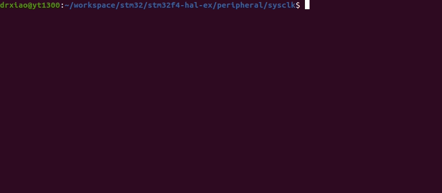

# STM32F4XX - Set System Clock
```shell
make
make flash
screen /dev/ttyUSB0
```

## Demo
* Remember to connect USART1 before using screen.
* Reset STM32 after using screen, then the two values of System Core Clock before/after setting will be printed.


