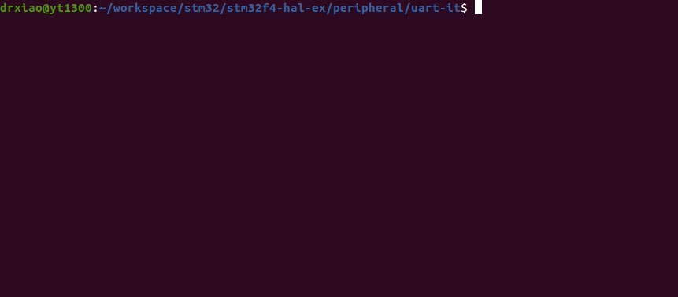

# STM32F4XX - UART with Interrupt
```shell
make
make flash
screen /dev/ttyUSB0
```

## Demo
* Press keyboard after using screen, and then STM32 becomes a typewriter
* The behaviors of receiving and sending are based on interrupt.

