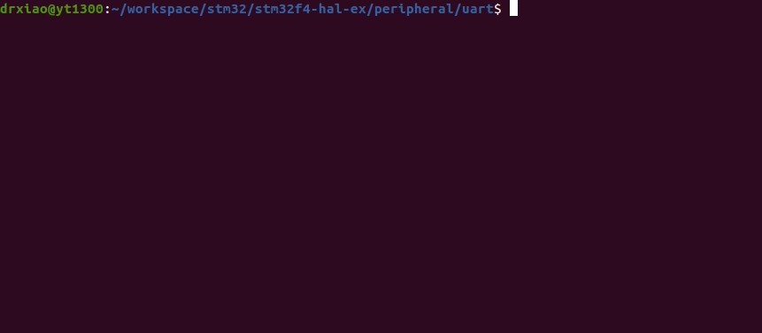

# STM32F4XX - UART
```shell
make
make flash
screen /dev/ttyUSB0
```

## Demo
* PA9 and PA10 and GND should be connected to USB-to-TTL module (ch340 or cp2102).
	* PA9  (TX) <---> RX
	* PA10 (RX) <---> TX 
	* GND       <---> GNU
* Press keyboard after using screen, and then STM32 becomes a typewriter


